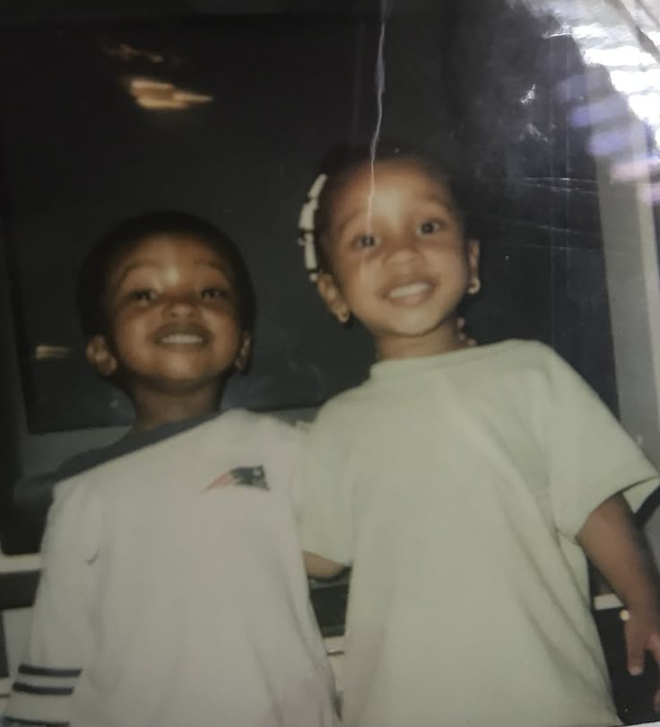

# ASSIGNMENT-1-INTERNET-PROGRAMMINg
'''html
<!DOCTYPE html>
<html lang="en">
<head>
  <meta charset="UTF-8">
  <title>Tribute to Wanjiru</title>
  <style>
    body {
      font-family: Arial, sans-serif;
      text-align: center;
      background-color: #f5f5f5;
      margin: 0;
      padding: 0;
    }
    #tribute-section {
      display: none;
      padding: 20px;
    }
    img {
      width: 200px;
      height: auto;
      border-radius: 10px;
      margin-top: 20px;
    }
    button {
      padding: 10px 20px;
      font-size: 16px;
      margin: 20px;
      cursor: pointer;
    }
  </style>
</head>
<body>

  <h2>This tribute is dedicated to my best friend, Wanjiru</h2>
  <br>
  <button onclick="showTribute()">Press to Continue</button>

  <div id="tribute-section">
    <h3>Tribute to Wanjiru</h3>
    <p>
      Wanjiru has been a constant source of strength, love, and inspiration in my life. 
      Her kindness, laughter, and wisdom continue to guide me through every step I take. 
      This tribute is a small reflection of the deep appreciation and admiration I have for her.
    </p>
    <p>
    From late-night talks to shared dreams, Wanjiru has always been more than a friend—she is family. 
      Thank you, Wanjiru, for being the light in my life.
    </p>
  </div>

  <script>
    function showTribute() {
      document.getElementById('tribute-section').style.display = 'block';
    }
  </script>

</body>
</html>
```
